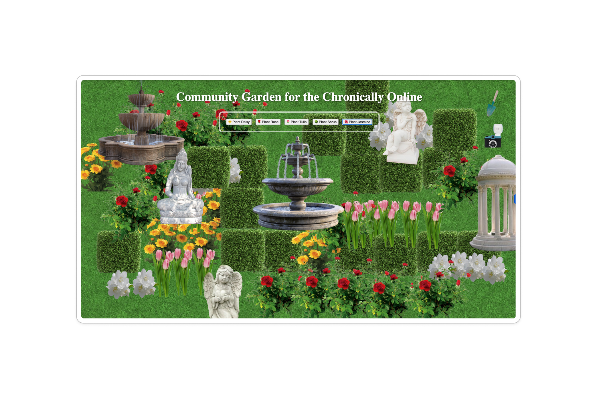

# Community Garden for the Chronically Online

## What is this?
I created this charming little community garden, a sanctuary in your browser for [HTML Day 2025](https://html.energy/html-day/2025), a celebration of the simplicity and beauty of the handmade web. The Community Garden for the Chronically Online is a perfect escape when you’re feeling tired from a long day or feeling information overload from all the stressors online. Take a leisurely stroll, soak in the beautiful surroundings, snap some shots with the Diana camera, plant some lovely blooms, or gently rearrange things — make yourself at home and enjoy the cosy vibe.

## Inspo
### Spaces
- **First spaces** are ones that are personal to us, our homes and our rooms.
- **Second spaces** are our workplaces where we spend most of our waking hours.
- **Third spaces** are public spaces that enable random encounters with people, things, and ideas.
- **Fourth spaces** are a relatively newly coined concept. They are public spaces where like-minded people convene ~ spaces for leisure, belonging and connection.

### Thoughts on 3rd Spaces
I’ve been really fascinated by third spaces—the places we pass by, wait and idle, where we congregate and meet. They serve as tools for self-discovery and exposing ourselves to new experiences beyond our usual routines, and are also the basis for the formation of fourth spaces. I often come up with fresh ideas during my commute or after walking around my neighbourhood, which led to why I wanted to bring to life this concept of CGCO. I wanted to translate this feeling of being mentally refreshed into a digital experience that fosters slow browsing and motivates users to reflect and engage with their surroundings. Public spaces in the digital realm, such as typical social networks and media sites, are a click-based attention economy driven by passive consumption and doom scrolling and incessantly swarmed with hate comments. I wanted to propose a more contemplative take on digital third spaces in my experiment, akin to stopping by your local park on the way home. This is a low-barrier way to create beauty amidst the ocean of digital trash and an ode to the community of the handmade web.

## Grattitude
I want to thank [Max](https://maxbo.me/) and [Hamish](https://www.hame.page/) for organising the [HTML in Hyde event](https://maxbo.me/html-in-hyde/index.html) ~ It’s huge to gather together so many people from different backgrounds on a rainy Sydney day. I really enjoyed the event and the chance to bounce ideas off all the interesting conversations I had with everyone. The HTML Energy community supports the culture of handmade websites. Thanks to [Spencer](https://spencer.place/), who created the [PlayHTML library](https://spencer.place/creation/playhtml/) and all the great open-source stuff they work on.

## Source Code
The source code for this site can be found in the repo at [https://github.com/incalescence/cgco](https://github.com/incalescence/cgco)